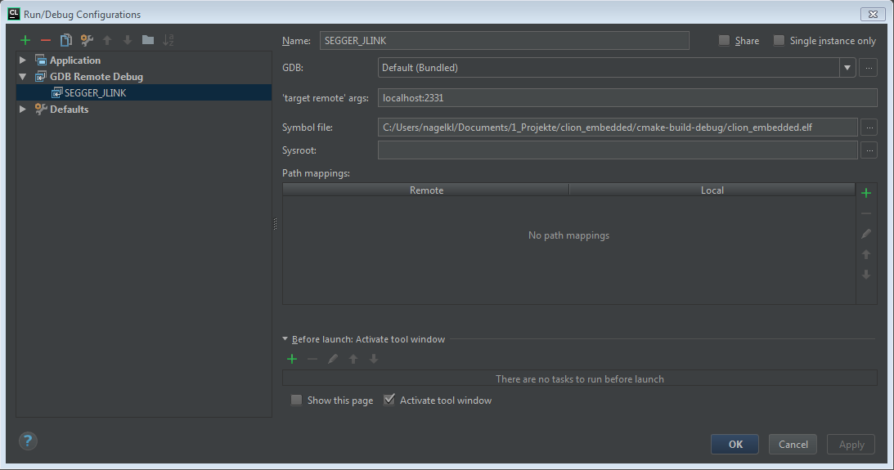
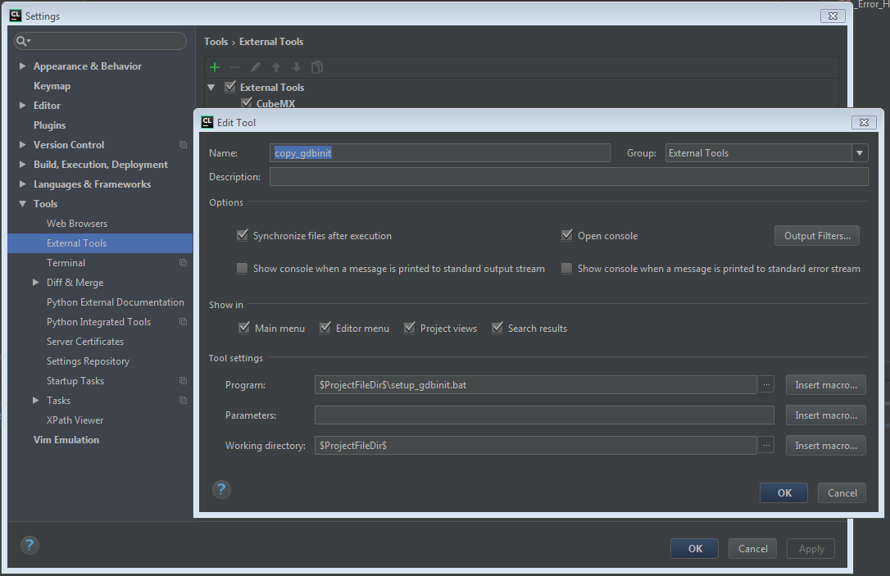
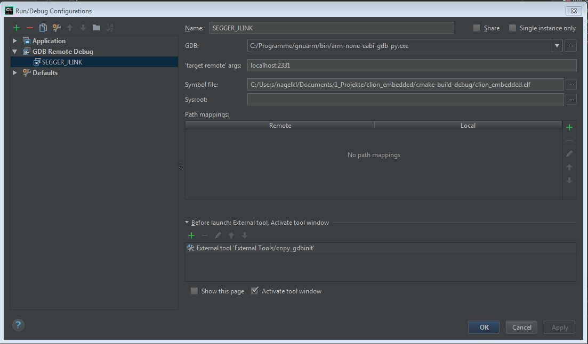

# clion_embedded
Embedded Development on STM32 with CLion and the Segger Tools

The [CLion IDE from Jetbrains](https://www.jetbrains.com/clion/) is a very powerful IDE for C/C++ developments with lots 
of features to increase developer productivity. This small demo project shows how to use CLion for embedded development. 
The Tools used are the [nucleo- board from ST](http://www.st.com/content/st_com/en/products/evaluation-tools/product-evaluation-tools/mcu-eval-tools/stm32-mcu-eval-tools/stm32-mcu-nucleo/nucleo-l476rg.html) 
but the approach should work on any platform with a gcc compiler, a gdb debugger and a gdbserver on the target or on 
some sort of JTAG- Probe. This demo project is heavily based on the Blog Post of [Ilya Motornyy](https://blog.jetbrains.com/clion/2016/06/clion-for-embedded-development/)
on the CLion blog.

## Prerequisites
There are some dependencies that have to be satisfied to build and run the demo.

In this demo we assume running all our tools on a Windows host.

### MINGW
On Windows hosts, CMake expects MINGW running on the host to have the make utility available.
Install a minimal MINGW Environment according to [this](http://www.mingw.org/wiki/Getting_Started) description.

After installation, test the MINGW environment by typing
    
    C:\Users\nagelkl>mingw32-make
    
in a terminal.

There should be a result similar to

    mingw32-make: *** No targets specified and no makefile found.  Stop.

### CLion IDE
Download and install the CLioin IDE from [Jetbrains](https://www.jetbrains.com/clion/).
There ist a free 30 Day evaluation licence available.

### Cross- gcc- toolchain for ARM
A gcc based cross- tool- chain for ARM microcontrolers can be obtained free of charge directly from [ARM](https://developer.arm.com/open-source/gnu-toolchain/gnu-rm/downloads).

Install the Toolchain for the windows host.

After installing, check if the tools are available on your PATH: Open a terminal and type

    C:\Users\nagelkl>arm-none-eabi-gcc

There should be some response like

    arm-none-eabi-gcc: fatal error: no input files
    compilation terminated.
    
If this is not the case, you have to append the _bin_ directory of the toolchain to your PATH and test again.

### The Segger jlink-gdbserver
The JLink gdb-server ist part of the Software- Tools from Segger. Download and install the latest version from 
[here](https://www.segger.com/downloads/jlink/#J-LinkSoftwareAndDocumentationPack).

### A STM nucleo- board with reflashed debugger firmware
You need a STM nucleo Board from STM. To be used with the Segger JLink- Tools, the firmware on the debug- part of the
nucleo- board has to be changed according to [this](https://www.segger.com/products/debug-probes/j-link/models/other-j-links/st-link-on-board/) description.

After the firmware change, the debug- part of the nucleo behaves like a SEGGER J-Link debug probe.

## Starting the JLink gdbserver
To start the Jlink gdbserver we have to open a terminal in the project root and execute the [StartupJLink.bat](StartupJLink.bat) script. 
This starts the Jlink gdbserver in CLI- Mode (without GUI) configured for the microcontroller on the nucleo board and
connects to the microcontroller core.
If everything is fine you should see an output similar to

    SEGGER J-Link GDB Server V6.12d Command Line Version
    
    JLinkARM.dll V6.12d (DLL compiled Dec 21 2016 16:56:08)
    
    -----GDB Server start settings-----
    GDBInit file:                  none
    GDB Server Listening port:     2331
    SWO raw output listening port: 2332
    Terminal I/O port:             2333
    Accept remote connection:      localhost only
    Generate logfile:              off
    Verify download:               off
    Init regs on start:            on
    Silent mode:                   off
    Single run mode:               off
    Target connection timeout:     0 ms
    ------J-Link related settings------
    J-Link Host interface:         USB
    J-Link script:                 none
    J-Link settings file:          none
    ------Target related settings------
    Target device:                 STM32L476RG
    Target interface:              SWD
    Target interface speed:        1000kHz
    Target endian:                 little
    
    Connecting to J-Link...
    J-Link is connected.
    Firmware: J-Link STLink V21 compiled Dec 21 2016 15:10:59
    Hardware: V1.00
    S/N: 770548980
    Checking target voltage...
    Target voltage: 3.30 V
    Listening on TCP/IP port 2331
    Connecting to target...Connected to target
    Waiting for GDB connection...

This shows you the gdbserver is ready to accept connections on port 2331.

## Configunring the debugger for working with the gdbserver
In Clion configure a new Run / Debug configuration:

Choose the symbol file according to where your project is located. 

__At the time of this writing the CLion gdbserver configuration does not read the .gdbinit file from the project root,
instead it reads it from %HOMEPATH%. The script [setup_gdbinit.bat](setup_gdbinit.bat) generates the necessary .gdbinit
 file in %HOMEPATH%__

The generated .gdbinit file forces a download of the binary file to the target. To make sure the right .gdbinit is present
the setup_gdbinit.bat script has to be run. 

This can be accomplished by setting the script as external tool for CLion: 

and running this tool as external tool in the debug- configuration:
 